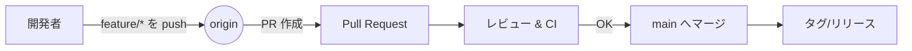

# GitHub 活用ガイド（使い方・Tips・豆知識）

> チームで迷子にならないための、最小だけど強い GitHub ルールと小技集。

---

## 目次

* [前提およびセットアップ](#前提およびセットアップ)
* [基本ワークフロー](#基本ワークフロー)
* [ブランチ戦略（選択肢）](#ブランチ戦略選択肢)
* [コミットメッセージ規約](#コミットメッセージ規約)
* [Pull Request 作法](#pull-request-作法)
* [Issue 運用](#issue-運用)
* [自動化: GitHub Actions 最小CI](#自動化-github-actions-最小ci)
* [セキュリティと保護設定](#セキュリティと保護設定)
* [便利コマンド](#便利コマンド)
* [小技集（豆知識）](#小技集豆知識)
* [トラブルシュート早見表](#トラブルシュート早見表)
* [Mermaid で見る開発フロー](#mermaid-で見る開発フロー)
* [参考リンク](#参考リンク)

---

## 前提およびセットアップ

* Git と GitHub アカウントを準備
* 推奨: **SSH** 接続、**GPG 署名**、**GitHub CLI (gh)**

```bash
# ユーザー設定
git config --global user.name "Your Name"
git config --global user.email "you@example.com"

# 既定ブランチ名を main に
git config --global init.defaultBranch main

# 署名（任意: GPG または SSH 署名）
git config --global commit.gpgsign true

# よくある改行と文字コード
# git config --global core.autocrlf input   # mac/Linux
git config --global core.autocrlf true  # Windows
```

**.gitignore / .gitattributes** の最低限:

```gitignore
# OS / IDE
.DS_Store
Thumbs.db
.vscode/
*.user
*.suo

# ビルド成果物
bin/
obj/
node_modules/
```

```gitattributes
* text=auto
*.sh eol=lf
*.bat eol=crlf
```

---

## 基本ワークフロー

1. リポジトリ取得

   ```bash
   git clone <repo-url>
   cd <repo>
   ```
2. 作業用ブランチを切る

   ```bash
   git switch -c feature/awesome
   # もしくは
   git checkout -b feature/awesome
   ```
3. こまめにコミット

   ```bash
   git add -A
   git commit -m "feat: 〇〇を追加"
   ```
4. リモートへプッシュ

   ```bash
   git push -u origin feature/awesome
   ```
5. Pull Request を作成し、レビュー→マージ

> 原則: main へは PR 経由。直接 push は禁止。

---

## ブランチ戦略（選択肢）

### A. トランクベース（推奨・小規模〜中規模）

* `main` のみを長生きブランチにし、短命な `feature/*` を切って素早くマージ
* リリースはタグで管理

### B. Git Flow（中〜大規模、長期運用）

* 長生き: `main`, `develop`
* 作業: `feature/*`, `release/*`, `hotfix/*`

| 用途    | ブランチ例                   | 備考                |
| ----- | ----------------------- | ----------------- |
| 新機能   | `feature/xyz`           | 小さく速く出す           |
| 不具合修正 | `fix/1234-typo`         | Issue 番号を含めると追跡が楽 |
| 緊急修正  | `hotfix/production-500` | main 直下から分岐       |

> チームでどちらかを選んで README に固定化しておくこと。

---

## コミットメッセージ規約

**Conventional Commits** ベース（例）

```
<type>(<scope>): <subject>

<body>

<footer>
```

**type 一覧**

| type     | 用途        |
| -------- | --------- |
| feat     | ユーザー向け新機能 |
| fix      | バグ修正      |
| docs     | ドキュメントのみ  |
| refactor | 仕様変更なしの整理 |
| perf     | 性能改善      |
| test     | テスト追加/更新  |
| build    | ビルド/依存関係  |
| ci       | CI 設定     |
| chore    | その他雑務     |
| revert   | 取り消し      |

**例**

```bash
git commit -m "feat(search): インクリメンタルサーチを追加"
git commit -m "fix(api): 500 を引き起こす null チェックを修正 (#123)"
```

---

## Pull Request 作法

**PR のタイトル**

* `feat: 〇〇を追加` のようにコミット規約に揃える

**説明テンプレ（例）**

```markdown
### 目的
- なぜこの変更が必要か

### 変更点
- 主な変更点の箇条書き

### 動作確認
- 再現手順 / 期待結果

### 影響範囲
- フロント/バック/DB/バッチ 等

### スクリーンショット
- UI 変更がある場合

### 参考
- 関連 Issue/PR/リンク
```

**レビューのコツ**

* 1 PR は 300 行以内を目安（大きくなるなら分割）
* 「質問」「提案」「必須修正」を区別
* LGTM 前にセルフレビューで差分を一度読み切る

**テンプレート設置**
`.github/pull_request_template.md` を作ると毎回適用されます。

---

## Issue 運用

**基本ルール**

* 1 Issue = 1 ゴール
* 必ずラベル、担当者、期限をセット

**Issue テンプレ（例）**
`.github/ISSUE_TEMPLATE/bug_report.md`

```markdown
---
name: Bug report
about: 不具合の報告
labels: bug
---

### 事象

### 再現手順

### 期待する結果

### 環境
- OS/ブラウザ/バージョン

### 追加情報
```

**ラベル運用の例**

* `type:bug` `type:feat` `priority:high` `status:wip` `area:frontend`

---

## 自動化: GitHub Actions 最小CI

`.github/workflows/ci.yml`

```yaml
name: ci
on: [push, pull_request]

jobs:
  build:
    runs-on: ubuntu-latest
    steps:
      - uses: actions/checkout@v4
      - uses: actions/setup-node@v4
        with:
          node-version: 20
      - run: npm ci
      - run: npm test --if-present
```

> 言語に合わせて setup-java/dotnet/go などへ置き換え。

**便利オプション**

* `concurrency` で同一ブランチの重複実行をキャンセル
* `paths` `paths-ignore` で不要なトリガーを抑制

---

## セキュリティと保護設定

* **Branch protection**: `main` に必須レビュー/ステータスチェック/直 push 禁止
* **CODEOWNERS**: 特定パスのレビュー担当を自動アサイン
* **Dependabot**: 依存の更新 PR を自動化
* **Secret scanning**: トークンや鍵の誤コミットを検出

`CODEOWNERS` 例:

```
# パスごとに所有者を指定
frontend/*  @frontend-team
api/*       @backend-team
```

---

## 便利コマンド

**Git**

```bash
# 直前のコミットを上書き
alias gca='git commit --amend --no-edit'

# 直近ログ
alias gl='git log --oneline --graph --decorate --all'

# よく使う
git restore -S <file>   # ステージだけ戻す
git restore <file>      # 作業ツリーを戻す
```

**GitHub CLI (gh)**

```bash
# 認証
gh auth login

# PR 作成
gh pr create -t "feat: ～" -b "説明～" -B main -H feature/awesome

# レビュー・マージ
gh pr view --web
gh pr merge --squash
```

---

## 小技集（豆知識）

* **コミットまとめ**: 複数コミットを 1 つに

  ```bash
  git rebase -i HEAD~5  # squash/fixup を選ぶ
  ```
* **直前を取り消し**: reset と revert の違い

  * `reset` は履歴を書き換え（共有前のみ）
  * `revert` は打ち消しコミット（共有後に安全）
* **一時退避**: 作業を stash

  ```bash
  git stash push -m "wip"
  git stash pop
  ```
* **犯人捜し**: bisect でバグ混入点を特定

  ```bash
  git bisect start
  git bisect bad              # 現在は壊れている
  git bisect good <commit>    # ここでは動いていた
  ```
* **巨大ファイルの誤コミット**: `git filter-repo` で除去（履歴書換に注意）
* **部分 clone**: sparse checkout で巨大モノレポの一部だけ取得

---

## トラブルシュート早見表

| 症状            | コマンド                                                       | 備考               |
| ------------- | ---------------------------------------------------------- | ---------------- |
| push が拒否された   | `git pull --rebase` → `git push`                           | コンフリクトは手動解消      |
| 作者名/メールが間違い   | `git commit --amend --author="Name <mail>"`                | 共有後は `revert` 推奨 |
| PR が肥大化       | `git reset -p` で差分を分割                                      | もしくはブランチを切り直す    |
| 間違って main で作業 | `git switch -c fix/split` → `git reset --hard origin/main` | まず退避             |

---

## Mermaid で見る開発フロー



---

## 参考リンク

* Git 公式: [https://git-scm.com/](https://git-scm.com/)
* GitHub Docs: [https://docs.github.com/](https://docs.github.com/)
* Conventional Commits: [https://www.conventionalcommits.org/ja/v1.0.0/](https://www.conventionalcommits.org/ja/v1.0.0/)
* Keep a Changelog: [https://keepachangelog.com/ja/1.1.0/](https://keepachangelog.com/ja/1.1.0/)

---

> チーム固有の補足（決めたらここに書く）
>
> * 例: ブランチ戦略はトランクベース固定
> * 例: PR は 1 人レビュー + CI 通過でマージ可
> * 例: main からのリリースは `vMAJOR.MINOR.PATCH` を付与
